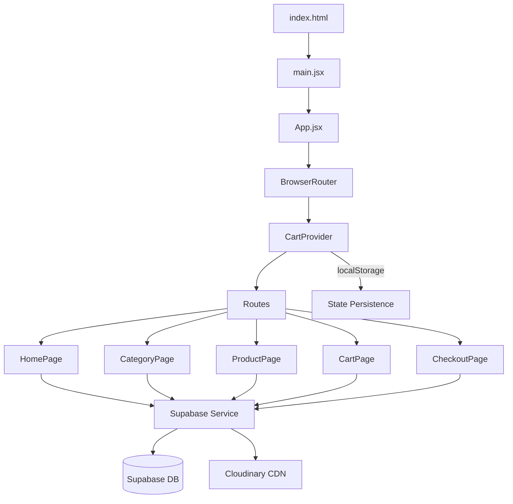

# 🛍️ GO SHOPPING — Premium E-Commerce Store (React Edition)

> Tienda online premium de productos importados: **262 productos sincronizados** en 9 categorías (Anillos, Humidificadores, Alcancías, Esencias, Quemadores, Tecnología, Mascotas, Hidrogel y Novedades). Una plataforma moderna construida con **React 19**, **Supabase** y **Cloudinary** para una experiencia de compra fluida y estética de alta gama.

---

## ✨ Características Principales

| Feature | Descripción |
|---------|-------------|
| ⚛️ **React 19 SPA** | Aplicación de una sola página ultra rápida con React Router 7 y Lazy Loading |
| 🗄️ **Supabase Backend** | Persistencia de datos en tiempo real, catálogo sincronizado dinámicamente |
| ☁️ **Cloudinary CDN** | Gestión inteligente de imágenes con optimización automática y carga rápida |
| 🛒 **Carrito Avanzado** | Gestión de estado reactiva con `CartContext`, persistencia local y variantes |
| ❤️ **Lista de deseos** | Favoritos persistentes con animaciones de `framer-motion` |
| 📱 **Responsive Design** | UI móvil optimizada con componentes táctiles y navegación fluida |
| 🔎 **SEO & Meta Tags** | Integración con `react-helmet-async` para SEO dinámico por producto |
| 🎬 **Animaciones Pro** | Transiciones suaves, staggered cards y micro-interacciones premium |
| 🚀 **Performance** | Código dividido (Code Splitting), Memoización y fetch eficiente |
| 💳 **Checkout Seguro** | Proceso de compra local optimizado con envío final vía WhatsApp |
| ⚡ **Compra Rápida** | Botón "Comprar Ahora" para flujo directo al pago sin pasos intermedio |

---

## 🧱 Stack Tecnológico

```
Vite 6               → Entorno de desarrollo y build
React 19             → Framework UI moderno
Supabase             → Base de datos PostgreSQL (BaaS)
Cloudinary           → Gestión de assets e imágenes
Tailwind CSS 3.4      → Framework de estilos utility-first
Framer Motion        → Librería de animaciones premium
React Router 7       → Enrutamiento avanzado
```

**Tipografías:** Inter (sans-serif) + Playfair Display (serif) para un look moderno y premium.
**Iconos:** Material Symbols Outlined (Google Fonts) + Lucide Icons.
**Imágenes:** Gestionadas en **Cloudinary** — Formatos WebP/AVIF automáticos

---

## 📁 Estructura del Proyecto

```
GoWEB/
├── public/                # Assets estáticos (logos, iconos)
├── scripts/               # Utilidades de mantenimiento y sincronización
├── src/
│   ├── main.jsx           # Punto de entrada de React
│   ├── App.jsx            # Componente raíz con Router y Providers
│   ├── components/        # Componentes UI (Header, Footer, ProductCard)
│   ├── context/           # Context API de React para gestión de estado
│   ├── hooks/             # Custom Hooks (useCart, useProducts)
│   ├── pages/             # Vistas de la aplicación (Home, Product, etc.)
│   ├── services/          # Cliente Supabase y llamadas a la API
│   ├── config/            # Configuración local de productos y categorías
│   └── style.css          # Estilos globales y Tailwind CSS
└── .env                   # Credenciales de Supabase y Cloudinary
```

---

## 🏗️ Arquitecture



### State Management (`context/`)
- **CartContext**: Gestión centralizada del carrito, wishlist y persistencia en `localStorage`.
- **Custom Hooks**: `useCart`, `useProducts`, `useSeo`.

### API & Services (`services/`)
- **supabase.js**: Cliente configurado para interactuar con la base de datos.
- **productService.js**: Capa de abstracción para fetch de productos, categorías y búsquedas.

---

## 🛒 Catálogo & Sincronización

El catálogo se define localmente en `/src/config/products.js` como **Source of Truth** y se sincroniza con Supabase mediante scripts automatizados.

### Scripts de Mantenimiento (`scripts/`)

| Script | Descripción |
|--------|-------------|
| `node scripts/syncProducts.js` | Sincroniza el catálogo local con la base de datos Supabase. |
| `node scripts/uploadImages.js` | Sube imágenes de `/public/images/` a Cloudinary automáticamente. |
| `node scripts/syncCategories.js` | Sincroniza la estructura de categorías. |

---

## 🛒 Catálogo de Productos

### 9 Categorías

| Categoría | Slug | Icono | Color |
|-----------|------|-------|-------|
| 💍 Anillos Premium | `anillos` | `diamond` | `#c9a34f` |
| 💨 Humidificadores | `humidificadores` | `humidity_mid` | `#5B8FB9` |
| 🐷 Alcancías | `alcancias` | `savings` | `#E8998D` |
| 🕯️ Esencias e Inciensos | `esencias` | `self_improvement` | `#8B5E3C` |
| 🔥 Quemadores | `quemadores` | `local_fire_department` | `#D4A854` |
| 💻 Tecnología | `tecnologia` | `devices` | `#2D3436` |
| 🐾 Mascotas | `mascotas` | `pets` | `#6C9A6C` |
| 💦 Hidrogel | `hidrogel` | `toys` | `#4FC3F7` |
| 🆕 Novedades | `novedades` | `new_releases` | `#6c5ce7` |

### Modelo de Producto

```javascript
{
  id, name, slug, category,
  price, oldPrice, currency: 'PEN',
  badge, images[],
  description, specs[{label, value}],
  fragrances: [{name, desc}],   // Solo en esencias
  rating, reviews, colors[], stock,
  tags[], relatedProducts[],
  isNew, isOnSale, salePercent
}
```

### Data API (`services/api.js`)

Capa de datos asíncrona con **caché en memoria** unificado:

- `getCategories()` — Fetch de `categories.json`
- `getProductsByCategory(slug)` — Fetch de `products/{slug}.json`
- `getProductBySlug(slug)` / `getProductById(id)` — Búsqueda unificada (categorías + all.json)
- `getProductsByIds(ids[])` — Batch fetch para Cart/Checkout
- `getDeals()` / `getNewArrivals()`
- `searchProducts(query)` — Búsqueda sobre `search.json`
- `getRelatedProducts(productId, limit)` — Productos relacionados

> **Nota:** `getAllProductsUnified()` fusiona todos los JSONs por categoría con `all.json` para resolver discrepancias de slugs entre archivos.

---

## 🎨 Paleta de Colores

| Token | Hex | Uso |
|-------|-----|-----|
| `primary` | `#c9a34f` | Dorado — botones y acentos principales |
| `primary-dark` | `#b08d43` | Dorado hover |
| `accent` | `#4B2E6F` | Púrpura — títulos, badges, mega-menu |
| `accent-dark` | `#362151` | Púrpura hover |
| `background-light` | `#FAFAFA` | Fondo general |
| `background-soft` | `#F4F1EC` | Fondo cálido alternativo |
| `background-dark` | `#1E1B14` | Modo oscuro |
| `surface-light` | `#ffffff` | Tarjetas y superficies |
| `text-main` | `#171512` | Texto principal |
| `text-muted` | `#827a68` | Texto secundario |
| `border-color` | `#e4e2dd` | Bordes |
| Footer BG | `#3B2066` | Fondo del footer |

---

## 🚀 Mejoras Recientes (UX/UI Revamp)

Se han implementado una serie de ajustes de precisión para elevar el look & feel premium de la tienda:

- **Contenedores Max-Focus**: Reducción global del ancho máximo a `1152px` (max-w-6xl) para una lectura más cómoda y centrada.
- **Tarjetas Square View**: Actualización de `ProductGridCard` a formato `aspect-square`, eliminando espacios en blanco y maximizando el tamaño de los productos.
- **Layout Compacto**: Reducción de hasta un 80% en espacios muertos (padding vertical) en las secciones de Beneficios, Categorías e Impacto Visual.
- **Breadcrumbs Funcionales**: Navegación de migas de pan operativa en la vista detallada para un retorno fluido a categorías e inicio.
- **One-Click Buy**: Implementación del botón "Comprar Ahora" con redirección automática al Checkout.

---

## 📱 Componentes Clave

### Layout (`components/Header.jsx`, `Footer.jsx`)
- **Header**: Glass design con `backdrop-filter`, mega-menu interactivo y búsqueda modal.
- **Footer**: Trust bar con 4 garantías de compra y navegación rápida.

### Vistas (`pages/`)
- **HomePage**: Hero interactivo, grid de categorías y productos destacados.
- **ProductPage**: Galería de imágenes, selectores de variantes (color/cantidad) y specs.
- **CategoryPage**: Vista de catálogo filtrada con sistema de ordenamiento.
- **CartPage**: Gestión de productos con persistencia de estado.
- **CheckoutPage**: Formulario dinámico optimizado para envíos en Perú.

---

## 🚀 Inicio Rápido

### Requisitos
- **Node.js** ≥ 18
- **npm** ≥ 9

### Instalación

```bash
# Clonar el repositorio
git clone <url-del-repo>
cd GoWEB

# Instalar dependencias
npm install

# Iniciar servidor de desarrollo
npm run dev
```

### Scripts Disponibles

| Comando | Descripción |
|---------|-------------|
| `npm run dev` | Servidor de desarrollo con HMR → `http://localhost:5173/` |
| `npm run build` | Build de producción → `dist/` |
| `npm run preview` | Previsualizar build de producción |
| `node scripts/syncProducts.js` | Sincroniza catálogo local -> Supabase |
| `node scripts/uploadImages.js` | Sincroniza imágenes locales -> Cloudinary |

---

## 🌐 SEO & Performance

- ✅ JSON-LD estructurado (Product, CollectionPage, WebSite)
- ✅ Open Graph y Twitter Cards dinámicos con `react-helmet-async`
- ✅ Gestión de imágenes mediante **Cloudinary CDN** para máxima velocidad
- ✅ Lazy loading nativo y mediante importaciones dinámicas de React
- ✅ Fuentes optimizadas con `preconnect`
- ✅ CSS-in-JS minimalista mediante Tailwind CSS
- ✅ Persistencia de estado ultra-ligera en `localStorage`
- ✅ Sanitización XSS en todos los flujos de datos

---

## 📄 Licencia

Proyecto privado — Todos los derechos reservados.
