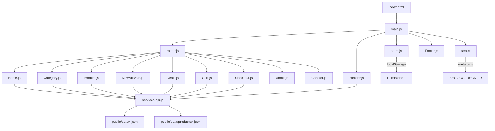

# 🛍️ GO SHOPPING — Premium E-Commerce Store

> Tienda online premium de productos importados: **97 anillos**, 34 quemadores, **100+ variedades de esencias**, 25 humidificadores, 11 accesorios para mascotas, 9 juguetes de hidrogel, tecnología, alcancías y accesorios. Una tienda, muchas categorías, productos seleccionados y calidad garantizada con estética de alta gama.

---

## ✨ Características Principales

| Feature | Descripción |
|---------|-------------|
| 🏠 **SPA completa** | Navegación fluida sin recargas, router hash-based con lazy loading |
| 🛒 **Carrito de compras** | Agregar, eliminar, actualizar cantidades con soporte de variantes (fragancias) |
| ❤️ **Lista de deseos** | Favoritos persistentes con toggle interactivo |
| 🔍 **Búsqueda instantánea** | Autocompletado en tiempo real con modal overlay sobre `search.json` |
| 🧪 **Selección de variantes** | Sistema dinámico de fragancias con selectores de cantidad múltiples e individuales |
| 📱 **Mobile first** | Diseño responsive con drawer de navegación móvil y CTA sticky |
| 🔎 **SEO dinámico** | Meta tags OG, Twitter Cards y JSON-LD por página |
| 🎬 **Animaciones Premium** | Staggered cards, fade-in, hover effects, glassmorphism |
| 🗂️ **Catálogo Masivo** | **300+ productos** organizados en 9 categorías con JSONs independientes |
| 🚀 **Performance** | Lazy Loading de páginas, Fetch con caché en memoria, `mix-blend-multiply` |
| 🛒 **Checkout Peruano** | Pago con Yape/Plin, orden completa enviada por WhatsApp |

---

## 🧱 Stack Tecnológico

```
Vite 6               → Build tool & dev server
Tailwind CSS 3.4      → Utility-first CSS framework
PostCSS + Autoprefixer → Procesamiento de estilos
Vanilla JavaScript     → Sin frameworks, SPA pura
```

**Tipografías:** Inter (sans-serif) + Playfair Display (serif) para un look moderno y premium.
**Iconos:** Material Symbols Outlined (Google Fonts).
**Imágenes:** Assets locales en `/public/images/` — WebP optimizados, mapeados al 100% del catálogo.

---

## 📁 Estructura del Proyecto

```
GoWEB/
├── index.html                 # Entry point HTML (mínimo, carga Vite)
├── package.json               # Dependencias y scripts
├── tailwind.config.js         # Colores custom, fuentes, animaciones
├── postcss.config.js          # PostCSS plugins
├── public/
│   ├── images/                # Assets locales organizados por categoría
│   │   ├── ring/              # 97 anillos
│   │   ├── esencias_cono/     # 36 esencias e inciensos
│   │   ├── quemadores/        # 34 quemadores
│   │   ├── humidificadores/   # 25 difusores
│   │   ├── mascotas/          # 11 accesorios mascotas
│   │   ├── hidrogel/          # 9 juguetes hidrogel
│   │   ├── alcancias/         # 8 alcancías
│   │   ├── tecnologia/        # Gadgets
│   │   ├── novedades/         # Novedades
│   │   └── categories/        # Imágenes de categorías
│   └── data/
│       ├── categories.json    # 9 categorías con iconos, colores, imágenes
│       ├── all.json           # Catálogo completo (300+ productos)
│       ├── deals.json         # 16 productos en oferta
│       ├── new.json           # Productos nuevos
│       ├── search.json        # Índice optimizado para búsqueda
│       └── products/          # JSONs por categoría (lazy-loaded)
│           ├── alcancias.json
│           ├── anillos.json
│           ├── esencias.json
│           ├── hidrogel.json
│           ├── humidificadores.json
│           ├── mascotas.json
│           ├── novedades.json
│           ├── quemadores.json
│           └── tecnologia.json
└── src/
    ├── main.js                # Entry point — inicializa router, header, footer, toasts
    ├── router.js              # Router hash-based con lazy loading de páginas
    ├── store.js               # State manager reactivo (pub/sub + localStorage)
    ├── seo.js                 # SEO dinámico (meta, OG, JSON-LD) por vista
    ├── style.css              # Tailwind directives + componentes custom (glassmorphism, cards)
    ├── utils.js               # Helpers: formatPrice, sanitize (XSS), debounce
    ├── services/
    │   └── api.js             # Fetch con caché + búsqueda unificada entre all.json y categorías
    ├── components/
    │   ├── Header.js          # Glass header, mega-menu, búsqueda overlay, drawer móvil
    │   └── Footer.js          # Trust bar, pagos (Yape/Plin), redes, contacto
    └── pages/
        ├── Home.js            # Hero, trust badges, categorías, productos destacados, newsletter
        ├── Category.js        # Hero banner, grid con sorting, breadcrumbs
        ├── Product.js         # Galería, fragancias, color swatches, specs, WhatsApp CTA
        ├── Cart.js            # Items con variantes, resumen, envío gratis +S/150
        ├── Checkout.js        # Formulario Perú (25 departamentos), Yape/Plin, orden WhatsApp
        ├── NewArrivals.js     # Grid de productos nuevos (isNew: true)
        ├── Deals.js           # Grid de ofertas con badges de descuento
        ├── About.js           # Historia, valores, diferenciadores
        └── Contact.js         # Formulario, FAQ accordion, WhatsApp directo
```

---

## 🏗️ Arquitectura



### Router (`router.js`)

| Ruta | Vista | Descripción |
|------|-------|-------------|
| `#/` | Home | Página principal con hero, categorías, deals |
| `#/categoria/:slug` | Category | Listado por categoría con sorting |
| `#/producto/:slug` | Product | Ficha de producto premium |
| `#/carrito` | Cart | Carrito de compras con resumen |
| `#/checkout` | Checkout | Proceso de pago (Yape/Plin → WhatsApp) |
| `#/novedades` | NewArrivals | Productos nuevos |
| `#/ofertas` | Deals | Productos en oferta |
| `#/nosotros` | About | Sobre la empresa |
| `#/contacto` | Contact | Formulario + FAQ + WhatsApp |

### Store (`store.js`)
State manager reactivo con patrón **pub/sub**:
- **Cart:** `addToCart(id, qty, variant)`, `removeFromCart`, `updateCartQuantity`, `clearCart`
- **Wishlist:** `toggleWishlist`, `isInWishlist`
- **Recently Viewed:** últimos 10 productos visitados
- **Dark Mode:** toggle con persistencia
- Variantes de fragancias almacenadas como `id__variant` keys

### SEO (`seo.js`)
Inyección dinámica por vista (8 funciones):
- `setHomeSeo`, `setCategorySeo`, `setProductSeo`, `setCartSeo`
- `setNewArrivalsSeo`, `setDealsSeo`, `setAboutSeo`, `setContactSeo`
- Open Graph, Twitter Cards, JSON-LD schemas

---

## 🛒 Catálogo de Productos

### 9 Categorías

| Categoría | Slug | Icono | Color |
|-----------|------|-------|-------|
| 💍 Anillos Premium | `anillos` | `diamond` | `#c9a34f` |
| 💨 Humidificadores | `humidificadores` | `humidity_mid` | `#5B8FB9` |
| 🐷 Alcancías | `alcancias` | `savings` | `#E8998D` |
| 🕯️ Esencias e Inciensos | `esencias` | `self_improvement` | `#8B5E3C` |
| 🔥 Quemadores | `quemadores` | `local_fire_department` | `#D4A854` |
| 💻 Tecnología | `tecnologia` | `devices` | `#2D3436` |
| 🐾 Mascotas | `mascotas` | `pets` | `#6C9A6C` |
| 💦 Hidrogel | `hidrogel` | `toys` | `#4FC3F7` |
| 🆕 Novedades | `novedades` | `new_releases` | `#6c5ce7` |

### Modelo de Producto

```javascript
{
  id, name, slug, category,
  price, oldPrice, currency: 'PEN',
  badge, images[],
  description, specs[{label, value}],
  fragrances: [{name, desc}],   // Solo en esencias
  rating, reviews, colors[], stock,
  tags[], relatedProducts[],
  isNew, isOnSale, salePercent
}
```

### Data API (`services/api.js`)

Capa de datos asíncrona con **caché en memoria** unificado:

- `getCategories()` — Fetch de `categories.json`
- `getProductsByCategory(slug)` — Fetch de `products/{slug}.json`
- `getProductBySlug(slug)` / `getProductById(id)` — Búsqueda unificada (categorías + all.json)
- `getProductsByIds(ids[])` — Batch fetch para Cart/Checkout
- `getDeals()` / `getNewArrivals()`
- `searchProducts(query)` — Búsqueda sobre `search.json`
- `getRelatedProducts(productId, limit)` — Productos relacionados

> **Nota:** `getAllProductsUnified()` fusiona todos los JSONs por categoría con `all.json` para resolver discrepancias de slugs entre archivos.

---

## 🎨 Paleta de Colores

| Token | Hex | Uso |
|-------|-----|-----|
| `primary` | `#c9a34f` | Dorado — botones y acentos principales |
| `primary-dark` | `#b08d43` | Dorado hover |
| `accent` | `#4B2E6F` | Púrpura — títulos, badges, mega-menu |
| `accent-dark` | `#362151` | Púrpura hover |
| `background-light` | `#FAFAFA` | Fondo general |
| `background-soft` | `#F4F1EC` | Fondo cálido alternativo |
| `background-dark` | `#1E1B14` | Modo oscuro |
| `surface-light` | `#ffffff` | Tarjetas y superficies |
| `text-main` | `#171512` | Texto principal |
| `text-muted` | `#827a68` | Texto secundario |
| `border-color` | `#e4e2dd` | Bordes |
| Footer BG | `#3B2066` | Fondo del footer |

---

## 📱 Componentes Clave

### Header (`Header.js`)
- Glass header con sticky + scroll blur (`backdrop-filter`)
- Logo "GO SHOPPING" + navegación desktop (5 items)
- **Mega-menu:** dropdown con 9 categorías (iconos Material + descripción)
- Búsqueda modal con autocompletado (`debounce 250ms`)
- Carrito con badge dinámico de conteo
- **Drawer móvil:** menú lateral con categorías, links, CTA WhatsApp

### Footer (`Footer.js`)
- **Trust bar:** 4 garantías (Originales, Envío, WhatsApp, Satisfacción)
- Navegación rápida + políticas
- Métodos de pago: Yape, Plin, Transferencia, Depósito
- Redes sociales + info (teléfono, email, ubicación)
- CTA WhatsApp directo
- Fondo púrpura premium (`#3B2066`)

### Home (`Home.js`)
- Hero section con imagen de fondo, badge "COLECCIÓN EXCLUSIVA 2025", CTA
- Trust badges (3 cards: Envío, Garantía, Soporte)
- Grid de categorías (4 cols, imágenes reales de `categories.json`, stagger animation)
- Productos destacados (8 cards con datos de `deals.json`)
- Preview de novedades (3 cards)
- Newsletter con formulario
- WhatsApp flotante (bottom-left)

### Product (`Product.js`)
- Galería con thumbnails clicables
- **Selector dinámico de fragancias:** Lista scrollable con descripción y selectores `[ - 0 + ]` individuales
- Selectores de color (swatches circulares)
- Especificaciones técnicas (accordion)
- Indicador de stock con estados (verde/amarillo/rojo)
- Botón "Agregar al carrito" + wishlist toggle
- **Sticky bottom CTA** en móviles
- CTA WhatsApp con mensaje pre-formateado (nombre + precio + URL)
- Trust signals (Envío, Garantía, Devolución, Eco-friendly)
- Productos relacionados (grid 4 cols)

### Cart (`Cart.js`)
- Lista de items con imagen, nombre, variante (fragancia), precio, cantidad
- Soporte para múltiples variantes del mismo producto
- Resumen: subtotal, envío (gratis +S/150), total
- CTA "Proceder al Pago"

### Checkout (`Checkout.js`)
- Formulario: nombre, teléfono, departamento (25 del Perú), ciudad, dirección
- Métodos de pago: Yape / Plin (radio buttons)
- Resumen de orden con scroll
- **Envío de pedido por WhatsApp:** orden completa pre-formateada con emojis
- Limpieza automática del carrito tras envío

---

## 🚀 Inicio Rápido

### Requisitos
- **Node.js** ≥ 18
- **npm** ≥ 9

### Instalación

```bash
# Clonar el repositorio
git clone <url-del-repo>
cd GoWEB

# Instalar dependencias
npm install

# Iniciar servidor de desarrollo
npm run dev
```

### Scripts Disponibles

| Comando | Descripción |
|---------|-------------|
| `npm run dev` | Servidor de desarrollo con HMR → `http://localhost:5173/` |
| `npm run build` | Build de producción → `dist/` |
| `npm run preview` | Previsualizar build de producción |

---

## 🌐 SEO & Performance

- ✅ JSON-LD estructurado (Product, CollectionPage, WebSite)
- ✅ Open Graph y Twitter Cards dinámicos por página
- ✅ Lazy loading de imágenes con `loading="lazy"`
- ✅ Lazy loading de páginas (dynamic `import()`)
- ✅ Fuentes con `preconnect` para carga óptima
- ✅ CSS utility-first (Tailwind) — bundle optimizado
- ✅ Assets 100% locales — sin dependencias de CDN externo
- ✅ Caché en memoria para fetch de datos (sin re-requests)
- ✅ Sanitización XSS en inputs de usuario

---

## 📄 Licencia

Proyecto privado — Todos los derechos reservados.
